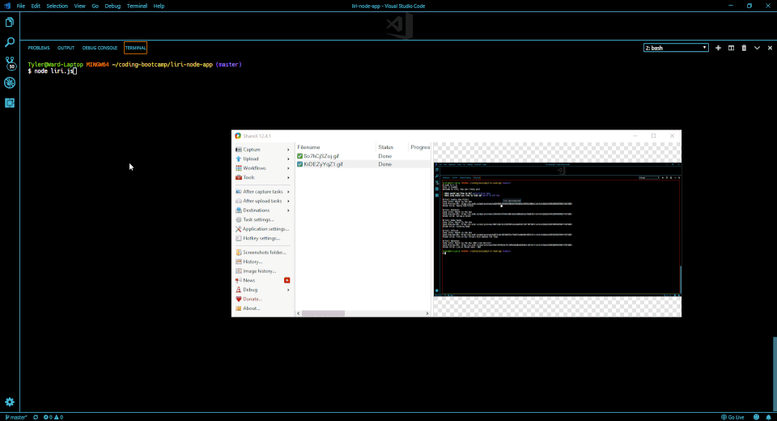

# liri-node-app
*A node based SIRI clone*

## Purpose:
LIRI is like iPhone's SIRI. However, while SIRI is a Speech Interpretation and Recognition Interface, LIRI is a _Language_ Interpretation and Recognition Interface. LIRI will be a command line node app that takes in parameters using inquirer and gives you back data from 3 different API endpoints.

## How it works:
When the file is run the user is presented with several choices using an inquirer list prompt. The users response is fed into a switch that does a second prompt based on the opton chosen. Each option calls a different method which performs an axios query to a different API. If a user doesn't provide a response to the second query a default is used for the axios query. The concert-this method uses the BandsinTown api and finds concert info based on an artist provided. The spotify-this method uses the Spotify API to provide song information based on the title passed in and will give the top 5 results. The movie-this method calls the OMDB api and provides information based on the movie title passed in. The final choice do-what-it-says reads in an external file "random.txt" and performs whatever action is listed in that file. All commands as well as data received is logged into log.txt using the fs.appendfile method from node.

## How to use:
To use the program you must make sure you have all the proper dependencies installed via node. You then run node liri.js which will provide you with the prompt to choose what information you would like.

If you select concert-this you will be asked what band you would like concert information for. After you type in an answer you will be provided with results if that band is currently on tour. The results include the name of the venue, the venue location, and the time and date of the concert.

If instead you chose spotify-this-song you will be asked what song, based on title, you would like to look up. Because multiple songs may have the same title, the top 5 results from spotify are provided with the artist, song title, album title, and a preview URL for the song.

If you select movie-this you will be asked what film you would like more information about. The information provided by the Online Move Data base will give you the title of the film, year released, IMDB rating, Rotten Tomatoes rating, production country, language, a short plot summary, and the main actors in the film.

Lastly if you select do-what-it-says, an external file, random.txt, will be read in and LIRI will perform the method provided in the file. This can be any of the 3 previous methods along with a parameter to pass in. 

## Contributors:
This project is maintained and contributed to solely by myself, Tyler Ward.